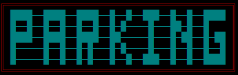
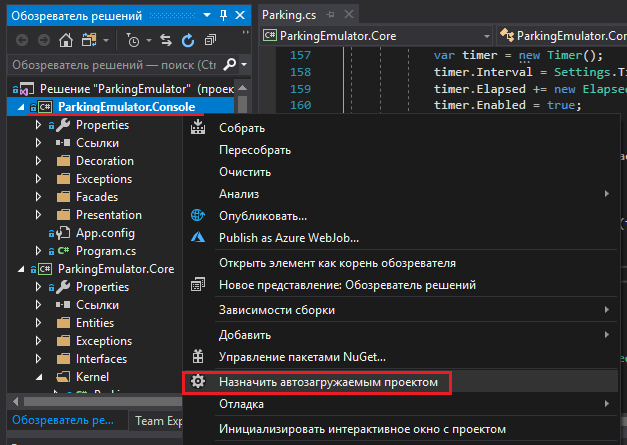

# ParkingEmulator

>Всем привет! Меня зовут Николай, я начинающий .NET разработчик. Мною было написано это консольное приложение, эмулирующее работу парковки.
## Основная идея и выбор архитектуры
Несмотря на то, что требованием было именно **консольное приложение**, я решил пойти немного вперёд и решил использовать классическую трёхуровневую архитектуру (о чём немного пожалел чуть позже :sweat_smile:). Я подумал, что так получиться сделать код менее связанным и обеспечить некую модульность.
## Вот как я это всё представил
* ParkingEmulator.Console - своеобразный слой представления, который отвечает непосредственно за работу с консолью (получение и валидация данных от пользователя, декор консоли).

* ParkingEmulator.Core - ядро, слой всей логики приложения. Я старался писать его таким образом, чтобы он никаким образом не зависел от других слоёв (вроде получилось :smirk:).

* ParkingEnulator.Log - слой, который отвечает за логирование данных и чтёние логов из файла.

## Основной функционал
### Зависящий от пользователя:
#### 1. Операции с машинами:
* Добавить машину на парковку
* Убрать машину с парковки
* Пополнить баланс машини стоящей на парковке машины
* Вывести список стоящих на парковке машин
* Вывести количество свободных мест

#### 2. Операции с транзакциями:
* Вывести транзакции за последнюю минуту (берутся из оперативной памяти)
* Вывести всю историю транзакций (считывается из файла Transactions.log)
* Вывести общий доход

#### 3. Настройки:
* Изменить цены на парковку для разных типов машин
* Изменить общее количество парковочных мест
* Изменить штраф за парковку

### Не зависящий от пользователя:
* Каждые 3 секунды со счетов всех автомобилей на стоянке списываются средства в зависимости от типа машины
* Каждую минуту в файл Transactions.log записываются транзакции за последнюю минуту
* Каждые 3 минуты из списка транзакций удаляются транзакции, которым больше 2 минут (это нужно, чтобы очистить оперативную память, ведь пользователь может получить доступ только к транзакциям за последнюю минуту, да и к тому же эти транзакции уже залогированы в файл)

## Вывод
На самом деле начиналось всё бодрячком :satisfied:. Архитектура была спланирована вроде нормально. Код писался чисто и красиво. Но, когда я начал пилить конкретно слой представления (консоль), то тут начались некоторые проблемы. Я начал жёстко путаться и теряться в своём же коде, очень много хардкодил и т.д.:worried:. В итоге я не совсем доволен своим результатом. Я бы оценил его так:
* Задумка архитектуры - 8/10
* Функционал - 7/10
* Качество кода - 4/10 (особенно стыдно за ParkingEmulator.Console)

# Важно!
Если после клонирования проекта вы попытаетесь его сбилдить и получите такую ошибку: "Проект, создающий библиотеку классов, не может быть непосредственно запущен.", то вам нужно сделать это 

# Спасибо за внимание!

